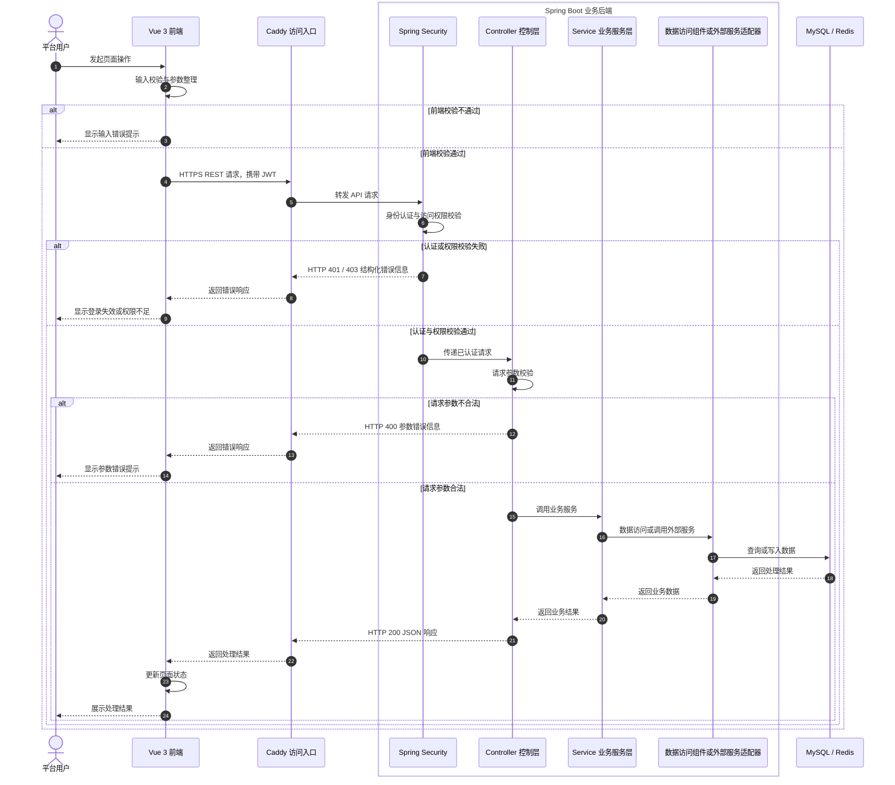

```mermaid
sequenceDiagram
    autonumber

    actor User as 平台用户
    participant Frontend as Vue 3 前端
    participant Caddy as Caddy 访问入口

    box Spring Boot 业务后端
        participant Security as Spring Security
        participant Controller as Controller 控制层
        participant Service as Service 业务服务层
        participant Access as 数据访问组件或外部服务适配器
    end

    participant Data as MySQL / Redis

    User->>Frontend: 发起页面操作
    Frontend->>Frontend: 输入校验与参数整理

    alt 前端校验不通过
        Frontend-->>User: 显示输入错误提示
    else 前端校验通过
        Frontend->>Caddy: HTTPS REST 请求，携带 JWT
        Caddy->>Security: 转发 API 请求
        Security->>Security: 身份认证与访问权限校验

        alt 认证或权限校验失败
            Security-->>Caddy: HTTP 401 / 403 结构化错误信息
            Caddy-->>Frontend: 返回错误响应
            Frontend-->>User: 显示登录失效或权限不足
        else 认证与权限校验通过
            Security->>Controller: 传递已认证请求
            Controller->>Controller: 请求参数校验

            alt 请求参数不合法
                Controller-->>Caddy: HTTP 400 参数错误信息
                Caddy-->>Frontend: 返回错误响应
                Frontend-->>User: 显示参数错误提示
            else 请求参数合法
                Controller->>Service: 调用业务服务
                Service->>Access: 数据访问或调用外部服务
                Access->>Data: 查询或写入数据
                Data-->>Access: 返回处理结果
                Access-->>Service: 返回业务数据
                Service-->>Controller: 返回业务结果
                Controller-->>Caddy: HTTP 200 JSON 响应
                Caddy-->>Frontend: 返回处理结果
                Frontend->>Frontend: 更新页面状态
                Frontend-->>User: 展示处理结果
            end
        end
    end
```