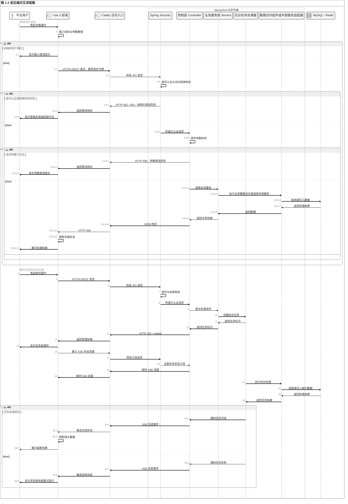

```mermaid
zenuml
    title 图 1-2 前后端交互流程图

    @Actor User as "平台用户" #FFFFFF
    @Boundary Frontend as "Vue 3 前端" #F7F7F7
    @Boundary Caddy as "Caddy 访问入口" #F7F7F7

    group "Spring Boot 业务后端" {
        Security as "Spring Security" #F7F7F7
        Controller as "控制层 Controller" #F7F7F7
        Service as "业务服务层 Service" #F7F7F7
        Task as "后台任务处理器" #F7F7F7
        Access as "数据访问组件或外部服务适配器" #F7F7F7
    }

    @Database Data as "MySQL / Redis" #F7F7F7

    @Starter(User)

    // 常规同步请求

    User->Frontend: 发起页面操作
    Frontend->Frontend: 输入校验与参数整理

    if("前端校验不通过") {
        Frontend->User: 显示输入错误提示
    } else {
        Frontend->Caddy: HTTPS REST 请求，携带身份令牌
        Caddy->Security: 转发 API 请求
        Security->Security: 身份认证与访问权限校验

        if("身份认证或权限校验失败") {
            Security->Caddy: HTTP 401 / 403，结构化错误信息
            Caddy->Frontend: 返回错误响应
            Frontend->User: 显示登录失效或权限不足
        } else {
            Security->Controller: 传递已认证请求
            Controller->Controller: 请求参数校验

            if("请求参数不合法") {
                Controller->Caddy: HTTP 400，参数错误信息
                Caddy->Frontend: 返回错误响应
                Frontend->User: 显示参数错误提示
            } else {
                Controller->Service: 调用业务服务
                Service->Access: 执行业务数据访问或调用外部服务
                Access->Data: 查询或写入数据
                Data->Access: 返回处理结果
                Access->Service: 返回数据
                Service->Controller: 返回业务结果
                Controller->Caddy: JSON 响应
                Caddy->Frontend: HTTP 200
                Frontend->Frontend: 更新页面状态
                Frontend->User: 展示处理结果
            }
        }
    }

    // 耗时任务的异步处理

    User->Frontend: 发起耗时操作
    Frontend->Caddy: HTTPS REST 请求
    Caddy->Security: 转发 API 请求
    Security->Security: 身份与权限校验
    Security->Controller: 传递已认证请求
    Controller->Service: 提交处理请求
    Service->Task: 创建后台任务
    Task->Service: 返回任务标识
    Service->Controller: 返回任务标识
    Controller->Caddy: HTTP 202 + taskId
    Caddy->Frontend: 返回受理结果
    Frontend->User: 显示任务处理中

    Frontend->Caddy: 建立 SSE 状态连接
    Caddy->Security: 转发订阅请求
    Security->Controller: 注册任务状态订阅
    Controller->Caddy: 保持 SSE 连接
    Caddy->Frontend: 保持 SSE 连接

    Task->Access: 执行后台处理
    Access->Data: 读取或写入相关数据
    Data->Access: 返回处理结果
    Access->Task: 返回任务结果

    if("任务处理成功") {
        Task->Controller: 通知任务完成
        Controller->Caddy: SSE 完成事件
        Caddy->Frontend: 推送完成状态
        Frontend->Frontend: 刷新相关数据
        Frontend->User: 展示最新结果
    } else {
        Task->Controller: 通知任务失败
        Controller->Caddy: SSE 失败事件
        Caddy->Frontend: 推送失败状态
        Frontend->User: 显示失败原因或重试提示
    }
```