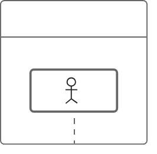

```mermaid
zenuml
    title EduTwin 前后端交互流程

    @Actor <<平台用户>> User #FFF2CC
    @Boundary <<Vue 3 前端>> Frontend #D9EAF7
    @EC2 <<Caddy 访问入口>> Gateway #E2F0D9
    @EC2 <<Spring Boot 业务后端>> Backend #E3FCEF
    @Database MySQL #FCE4D6
    @Database Redis #F4CCCC
    @Queue <<Redis Stream>> EventStream #D9D2E9
    @Lambda <<Spring Boot 分析消费者>> Worker #DDEBF7
    @EC2 <<FastAPI 模型服务>> ModelService #E4DFEC

    group 用户登录 {
        @Starter(User)
        // 输入账号和密码
        Frontend.login(credentials) {
            // `POST /api/v1/auth/login`
            Gateway.forwardLogin(credentials) {
                Backend.authenticate(credentials) {
                    account = MySQL.findUser(credentials.username)

                    if(account.valid) {
                        token = Backend.issueJwt(account)
                        Frontend.storeSession(token, account.role)
                    } else {
                        Frontend.showLoginError()
                    }
                }
            }
        }
    }

    group 常规同步请求 {
        @Starter(User)
        // 查询课程、成绩或学习画像
        Frontend.requestData(token, request) {
            Gateway.forwardApiRequest(token, request) {
                Backend.handleRequest(token, request) {
                    Backend.verifyIdentity(token)
                    Backend.checkRoleAndDataScope(request)

                    if(request.authorized) {
                        cachedData = Redis.get(request.cacheKey)

                        if(cachedData != null) {
                            response = cachedData
                        } else {
                            response = MySQL.queryBusinessData(request)
                            Redis.set(request.cacheKey, response)
                        }

                        Frontend.render(response)
                    } else {
                        Frontend.showRequestError("400 / 401 / 403")
                    }
                }
            }
        }
    }

    group 学生作答与异步分析 {
        @Starter(User)
        // 提交题目作答
        Frontend.submitAnswer(token, answer) {
            // `POST /api/v1/courses/{courseId}/answers`
            Gateway.forwardAnswer(token, answer) {
                Backend.acceptAnswer(token, answer) {
                    Backend.checkCoursePermission(answer.courseId)

                    MySQL.transaction() {
                        MySQL.saveAnswerEvent(answer)
                        MySQL.createAnalysisJob(answer)
                        MySQL.saveOutboxEvent(answer)
                    }

                    jobId = Backend.returnAccepted("202 Accepted")
                    Frontend.receiveJobId(jobId)
                }
            }
        }

        par {
            // 前端订阅任务状态
            Frontend.subscribeAnalysisEvents(jobId) {
                Gateway.openSseConnection(jobId) {
                    Backend.registerSseSubscriber(jobId)
                }
            }

            // 后端发布并消费分析任务
            Backend.publishAnalysisEvent(jobId) {
                event = MySQL.readOutboxEvent(jobId)
                EventStream.publish(event)

                Worker.consume(event) {
                    prediction = ModelService.infer(event)

                    if(prediction.available) {
                        Worker.useModelResult(prediction)
                    } else {
                        Worker.runRuleFallback(event)
                    }

                    MySQL.transaction() {
                        MySQL.saveTwinSnapshot()
                        MySQL.saveLearningPlan()
                        MySQL.completeAnalysisJob(jobId)
                    }

                    Redis.refreshLearningCache(jobId)

                    Backend.pushCompletedEvent(jobId) {
                        Gateway.forwardSseEvent(jobId) {
                            Frontend.receiveCompletedEvent(jobId)
                        }
                    }
                }
            }
        }

        Frontend.reloadLearningData(jobId) {
            Gateway.forwardRefreshRequest(jobId) {
                Backend.getLatestLearningData(jobId) {
                    result = MySQL.findLatestTwinAndPlan(jobId)
                    Frontend.renderLearningResult(result)
                    User.viewUpdatedLearningData()
                }
            }
        }
    }
```