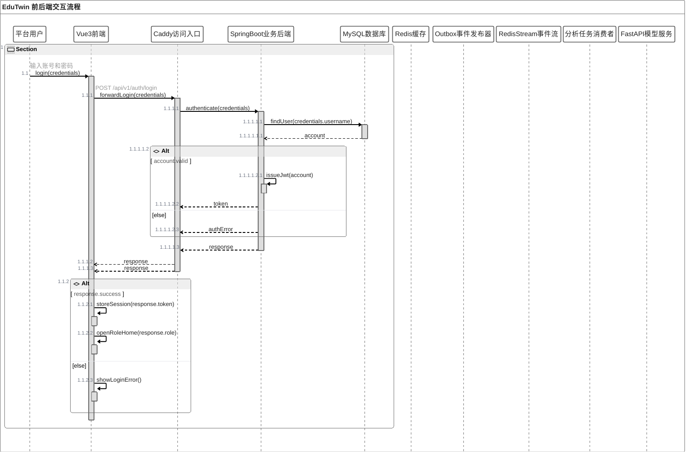

```mermaid
zenuml
    title EduTwin 前后端交互流程

    U as 平台用户
    FE as Vue3前端
    GW as Caddy访问入口
    BE as SpringBoot业务后端
    DB as MySQL数据库
    CACHE as Redis缓存
    PUB as Outbox事件发布器
    ES as RedisStream事件流
    W as 分析任务消费者
    MS as FastAPI模型服务

    group 用户登录 {
        // 输入账号和密码
        U->FE.login(credentials) {
            // `POST /api/v1/auth/login`
            response = GW.forwardLogin(credentials) {
                response = BE.authenticate(credentials) {
                    account = DB.findUser(credentials.username)

                    if(account.valid) {
                        token = BE.issueJwt(account)
                        return token
                    } else {
                        return authError
                    }
                }

                return response
            }

            if(response.success) {
                FE.storeSession(response.token)
                FE.openRoleHome(response.role)
            } else {
                FE.showLoginError()
            }
        }
    }

    group 常规同步请求 {
        // 查询课程、成绩或学习画像
        U->FE.requestData(token, request) {
            response = GW.forwardApiRequest(token, request) {
                response = BE.handleRequest(token, request) {
                    BE.verifyIdentity(token)
                    BE.checkRoleAndDataScope(request)

                    if(request.authorized) {
                        cachedData = CACHE.get(request.cacheKey)

                        if(cachedData != null) {
                            return cachedData
                        } else {
                            data = DB.queryBusinessData(request)
                            CACHE.set(request.cacheKey, data)
                            return data
                        }
                    } else {
                        return requestError
                    }
                }

                return response
            }

            if(response.success) {
                FE.renderData(response.data)
            } else {
                FE.showRequestError(response.status)
            }
        }
    }

    group 学生作答 {
        // 提交题目作答
        U->FE.submitAnswer(token, answer) {
            // `POST /api/v1/courses/{courseId}/answers`
            jobId = GW.forwardAnswer(token, answer) {
                jobId = BE.acceptAnswer(token, answer) {
                    BE.checkCoursePermission(answer.courseId)
                    DB.saveAnswerAnalysisAndOutbox(answer)
                    return jobId
                }

                return jobId
            }

            FE.showAccepted(jobId)
        }

        // 建立任务状态订阅
        FE->GW: 建立SSE连接
        GW->BE: 订阅分析任务状态
    }

    group 异步学情分析 {
        // 后台读取并发布待处理事件
        PUB->DB: 读取Outbox事件
        PUB->ES: 发布分析事件

        ES->W.processAnalysis(event) {
            try {
                result = MS.infer(event)
            } catch {
                result = W.runRuleFallback(event)
            }

            DB.saveTwinSnapshot(result)
            DB.saveLearningPlan(result)
            DB.completeAnalysisJob(event.jobId)
            CACHE.refreshLearningData(event.jobId)

            W->BE: 通知分析任务完成
            BE->GW: 推送SSE完成事件
            GW->FE: 转发SSE完成事件
        }
    }

    group 学情结果刷新 {
        FE->GW: 请求最新学情数据

        result = GW.forwardRefreshRequest(jobId) {
            result = BE.getLatestLearningData(jobId) {
                result = DB.findLatestTwinAndPlan(jobId)
                return result
            }

            return result
        }

        FE.renderLearningResult(result)
        FE->U: 展示学习画像和学习计划
    }
```